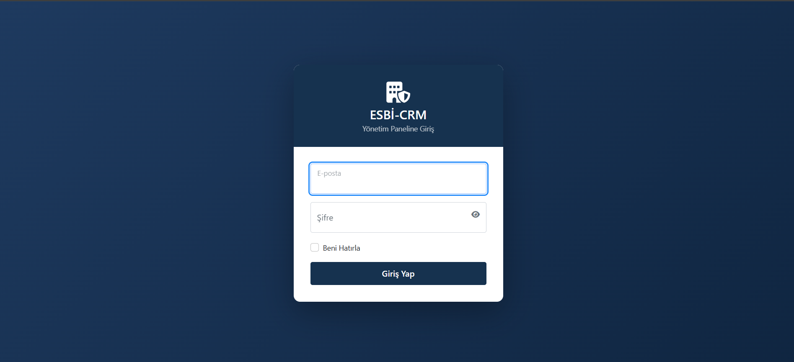
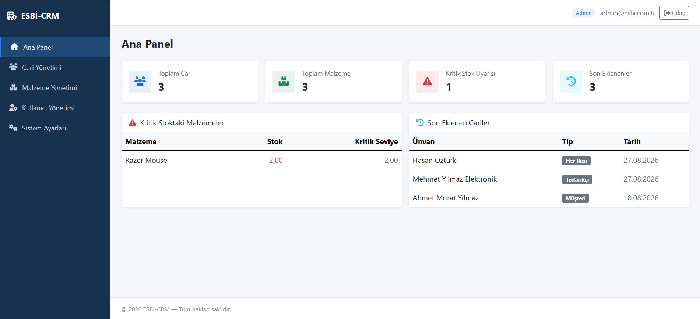
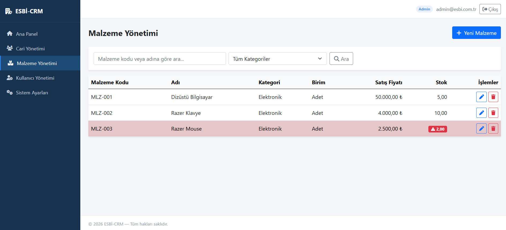
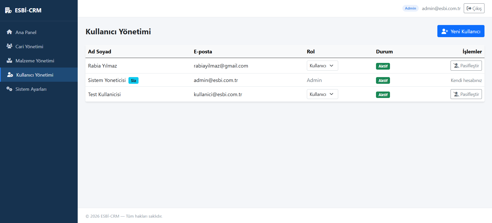
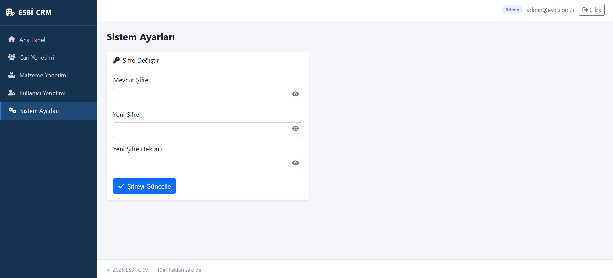

# ESBİ-CRM-Proje

ASP.NET Core MVC ile geliştirilmiş, katmanlı mimariye sahip bir müşteri ilişkileri yönetim (CRM) uygulaması.
## Özellikler

- **Kimlik doğrulama ve rol bazlı yetkilendirme** — ASP.NET Core Identity ile Admin / Kullanıcı rolleri
- **Cari Yönetimi** — müşteri/tedarikçi kayıtlarında listeleme, arama, ekleme, düzenleme, soft-delete silme
- **Malzeme Yönetimi** — stok kayıtlarında listeleme, kategori filtreleme, kritik stok renk vurgulaması, CRUD işlemleri
- **Ana Panel (Dashboard)** — toplam cari/malzeme sayısı, kritik stok uyarıları, son eklenen kayıtlar
- **Kullanıcı Yönetimi** *(yalnızca Admin)* — kullanıcı ekleme, rol değiştirme, aktif/pasif yapma
- **Sistem Ayarları** — şifre değiştirme

## Ekran Görüntüleri

| Giriş Ekranı | Ana Panel |
|---|---|
|  |  |
| Gradient arka planlı, şifre göster/gizle özellikli giriş ekranı | Toplam cari/malzeme sayısı, kritik stok uyarısı ve son eklenen kayıtların özet kartları |

| Cari Yönetimi | Malzeme Yönetimi |
|---|---|
|  |  |
| Arama, listeleme ve rol bazlı silme yetkisi | Kritik stoktaki malzemelerin kırmızı vurgulandığı liste |

| Kullanıcı Yönetimi | Sistem Ayarları |
|---|---|
|  |  |
| Rol değiştirme ve aktif/pasif yapma (yalnızca Admin) | Şifre değiştirme ekranı |

## Teknoloji Yığını

| Katman | Teknoloji |
|---|---|
| Backend | ASP.NET Core MVC (.NET 8) |
| ORM | Entity Framework Core 8 (Code First) |
| Veritabanı | Microsoft SQL Server |
| Kimlik Doğrulama | ASP.NET Core Identity |
| Ön Yüz | Bootstrap 5, Font Awesome |

## Mimari

Proje, sorumlulukların ayrıştırılması ilkesiyle üç katmana bölünmüştür:

```
CRMProject.Web/       → MVC katmanı (Controllers, Views, ViewModels)
CRMProject.Data/      → Veri erişim katmanı (Entities, AppDbContext, Migrations, Seed)
CRMProject.Services/  → İş mantığı katmanı (Interfaces, Implementations)
```

Bağımlılıklar tek yönlü akar: `Web → Services → Data`.

## Kurulum

1. Depoyu klonlayın:
   ```
   git clone <https://github.com/RaabiaaYilmaz/ESBI-CRM-Proje>
   ```
2. `CRMProject.Web/appsettings.json` içindeki bağlantı dizesini kendi SQL Server örneğinize göre düzenleyin:
   ```json
   "DefaultConnection": "Server=.\\SQLEXPRESS;Database=CRMProjectDb;Trusted_Connection=True;TrustServerCertificate=True;"
   ```
3. Paket Yöneticisi Konsolu'nda migration'ı uygulayın:
   ```
   Update-Database
   ```
4. Uygulamayı çalıştırın.

Uygulama ilk çalıştığında roller ve varsayılan admin hesabı otomatik olarak oluşturulur:

| Alan | Değer |
|---|---|
| E-posta | admin@esbi.com.tr |
| Şifre | Admin@123! |

> Güvenlik notu: Üretim ortamına taşımadan önce varsayılan admin şifresini değiştirin.

## Proje Yapısı

```
Controllers/   → HTTP isteklerini karşılar, iş mantığını Service katmanına devreder
Services/      → İş kuralları ve veritabanı sorguları (Interface + Implementation)
Entities/      → Veritabanı tablolarına karşılık gelen modeller
ViewModels/    → View'lara özel, doğrulama öznitelikli veri taşıyıcıları
Views/         → Razor görünümleri (Bootstrap 5 tabanlı)
```
